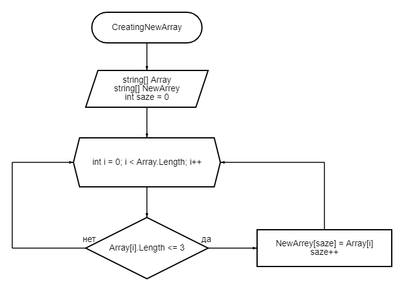

# _Задача:_ 
_Написать программу, которая из имеющегося массива строк формирует новый массив из строк, длина которых меньше, либо равна 3 символам. Первоначальный массив можно ввести с клавиатуры, либо задать на старте выполнения алгоритма. При решении не рекомендуется пользоваться коллекциями, лучше обойтись исключительно массивами._

# _Описание алгоритма:_
* Задаем массив из строк разной длинны;
* Объявляем новый массив, который в последющем будем заполнять;
* С помощью фунции "Void CreatingNewArray" прописываем условие, по которому в новый массив попадут строки длинной не больше трех символов;
* Следующей функцией "Void PrintArray" выводим новый массив на экран.

## БЛОК-СХЕМА

